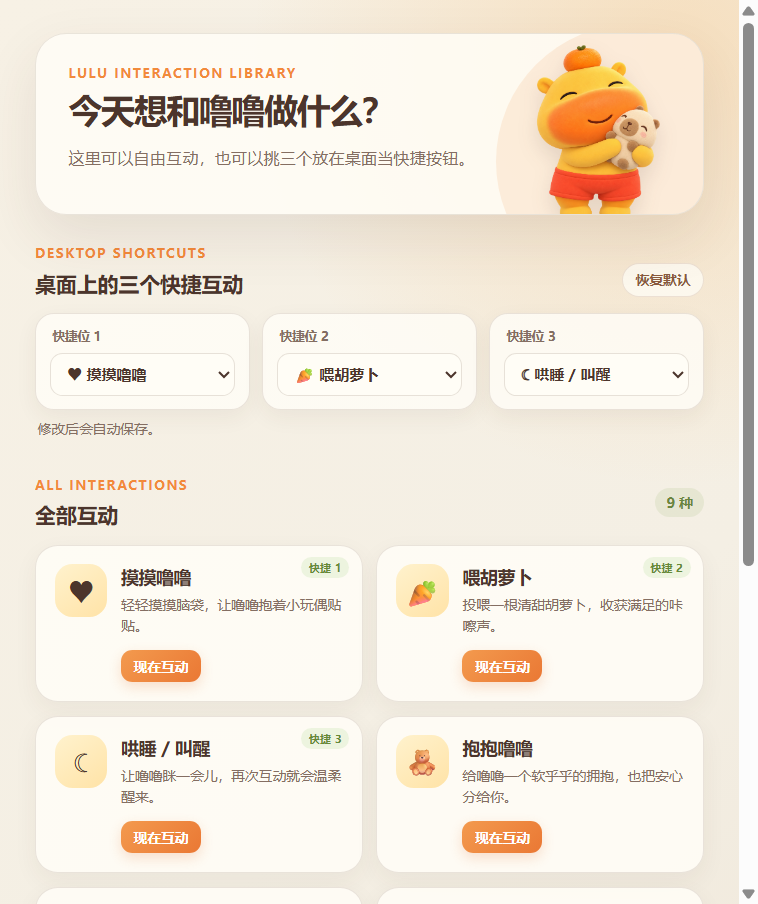
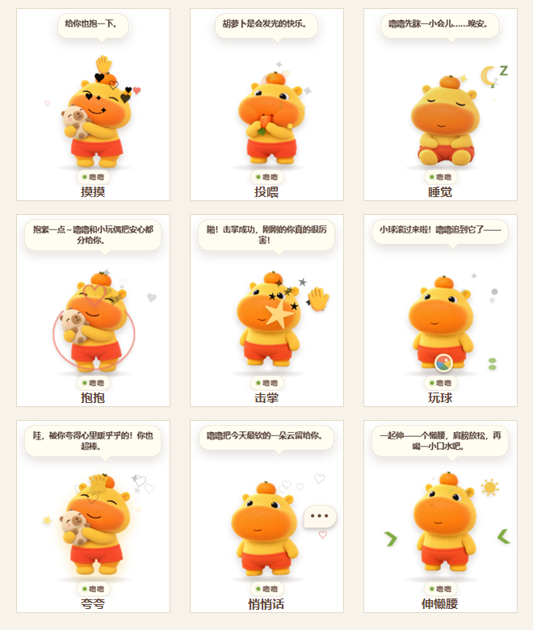

# 水豚噜噜桌面宠物

一只会散步、撒娇、吃胡萝卜、抱玩偶，也会安静陪伴你的 Windows 桌面宠物。

噜噜采用透明悬浮窗口，平时只显示角色和三个快捷按钮；需要更多玩法时，可以从右键菜单或托盘打开互动库，自由选择互动并重新配置三个快捷位。

<p align="center">
  
</p>

## 功能

- 透明、无边框、始终置顶的桌面宠物窗口
- 9 种专属互动动画：摸摸、投喂、睡觉、抱抱、击掌、玩球、夸夸、悄悄话、伸懒腰
- 可配置互动库：任意挑选三个互动放到桌面快捷按钮
- 点击切换表情，双击快速投喂胡萝卜
- 可拖动到桌面任意位置，角色、按钮和名称始终整体移动
- 自由散步、碰到屏幕边缘自动掉头
- 托盘菜单：显示/隐藏、互动库、散步开关、置顶开关、开机启动与退出
- 互动次数和快捷按钮会保存在本机
- 适配 Windows 125% 等显示缩放，拖动时锁定透明窗口尺寸

## 实机展示

### 桌面形态

桌面上只保留三个快捷互动。鼠标移到噜噜附近时按钮出现，移开后自动隐藏。

<p align="center">
  
</p>

### 互动库

互动库展示全部互动。顶部三个下拉框对应桌面快捷位，修改后自动保存；下方任意卡片都可以直接触发互动。



## 安装与使用

### 直接运行

1. 前往 [Releases](https://github.com/xingchenyd/lulu-desktop-pet/releases/latest)。
2. 下载 `Lulu-Desktop-Pet-1.3.0-Compatible.zip`。
3. 完整解压 ZIP，不要只把 EXE 单独移出文件夹。
4. 双击文件夹中的 `水豚噜噜.exe`。

### 常用操作

| 操作 | 效果 |
| --- | --- |
| 单击噜噜 | 在可爱、贴贴和小脾气之间切换 |
| 双击噜噜 | 快速喂一根胡萝卜 |
| 拖动噜噜 | 将整个桌面宠物移动到新位置 |
| 鼠标悬停 | 显示三个快捷互动按钮 |
| 右键噜噜 | 打开菜单和互动库入口 |
| 单击托盘图标 | 显示或隐藏噜噜 |

### 自定义三个快捷互动

1. 右键噜噜，选择“打开互动库…”；也可以从系统托盘打开。
2. 在“桌面上的三个快捷互动”中选择三个不同的互动。
3. 选择结果会立即保存，桌面按钮同步更新。
4. 点击“恢复默认”可恢复为摸摸、胡萝卜和睡觉。

## 互动一览



| 互动 | 表现 |
| --- | --- |
| 摸摸噜噜 | 手掌从头顶轻拍，噜噜闭眼抱起小玩偶蹭一蹭 |
| 喂胡萝卜 | 切换到专属吃胡萝卜姿势，连续咀嚼并弹出碎屑 |
| 哄睡 / 叫醒 | 坐下闭眼缓慢呼吸，月亮、星光和 Z 持续漂浮 |
| 抱抱噜噜 | 抱紧小玩偶左右摇晃，爱心拥抱环收拢并跳动 |
| 和噜噜击掌 | 跳向迎面而来的手掌，碰掌时炸开庆祝星光 |
| 一起玩小球 | 彩色小球横向滚动和弹跳，噜噜追球连续起跳 |
| 夸夸噜噜 | 皇冠落到头顶，噜噜挺起胸口并被金色光芒包围 |
| 说悄悄话 | 噜噜侧身凑近，省略号气泡和小爱心飘向耳边 |
| 一起伸懒腰 | 踮脚拉长身体，太阳升起、叶片舒展、水滴落下 |

每项互动使用独立的角色运动曲线、道具轨迹、粒子效果和音效节奏，不再只是复用同一组“开心 / 走路”动画。

## 从源码运行

环境要求：Windows 10/11、Node.js 20 或更高版本。

```powershell
git clone https://github.com/xingchenyd/lulu-desktop-pet.git
cd lulu-desktop-pet
npm install
npm start
```

代码检查与打包：

```powershell
npm run check
npm run pack
```

打包结果默认生成在 `dist/`。

## 项目结构

```text
assets/             噜噜的各状态图片与图标
docs/screenshots/   README 使用的真实运行截图
index.html          桌面宠物界面
renderer.js         动画、互动和快捷按钮逻辑
library.html        互动库界面
library.js          快捷位设置与互动库逻辑
interactions.js     共享互动目录
main.js             Electron 窗口、托盘、设置与拖拽逻辑
preload.js          安全的主进程通信桥
```

## 数据与安全

- 设置只保存在 Electron 的本机用户数据目录中，不会上传。
- 应用不需要网络连接，也不收集遥测数据。
- Release 为未购买商业证书的个人构建。如果单位电脑执行企业应用控制策略，请遵守组织规定；可以直接从源码审查和运行。

## License

代码采用 [MIT License](LICENSE)。角色形象及图片素材请仅用于学习、展示与个人用途。
